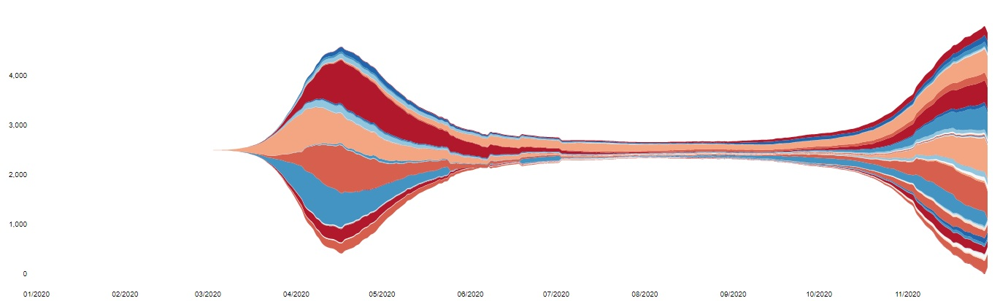
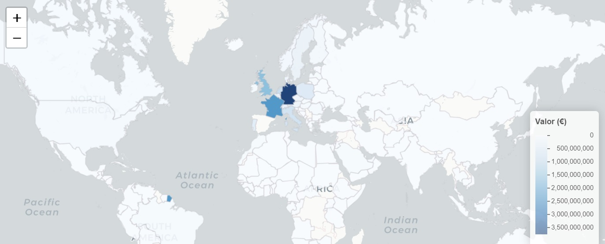
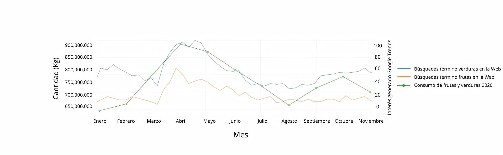
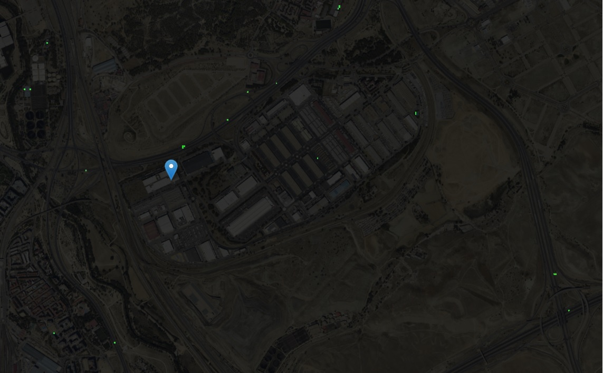

## La pandemia COVID19 y el reto Cajamar Agro Analysis

Este sitio se ha desarrollado con el objetivo principal de analizar el comportamiento del mercado español de frutas y verduras durante el período de la pandemia COVID19. También podrá ser utilizada como una herramienta que ayude a los agentes de la cadena de valor de las frutas y verduras a tomar las mejores decisiones basadas en datos, para enfrentarse a nuevas alteraciones que se produzcan en el mercado.

Esta aplicación consta de  distintas partes:

### Covid
Aquí podrás visualizar el desarrollo de la pandemia: ver la evolución de 2 indicadores básicos como son el 
número de muertes y el número de contagiados de cada país. 

Cuando comenzó la pandemia, rápidamente los países comenzaron a tomar medidas. Investiga cuáles fueron esas medidas y cuándo las tomó cada país en el apartado de "Restricciones". 

Por ejemplo, podrás ver la evolución de las muertes causadas por la  pandemia en Europa:

 

### Comercio Exterior
¿Quieres descubrir cuáles son las principales frutas y verduras que importa y exporta España? Dirígete al apartado "El comercio exterior en España". En "saldo del Comercio Exterior en los últimos años" podrás investigar el comercio exterior desde el 2012, viendo como sigue aumentando el valor de las exportaciones año tras año.
Si prefieres investigar qué países son los principales socios comerciales de España dirígete a "Análisis de los flujos comerciales" y podrás visualizar mapas como este que muestra las exportaciones en valor:

 

### Comercio y Consumo Interior
Aquí podrás descubrir desde el precio en origen que obtienen los agricultores hasta el precio que pagan los consumidores en cada Comunidad Autónoma, pasando por el precio de los productos en los 5 principales Mercas 
españoles. También podrás visualizar el aumento que han tenido las ventas online durante la pandemia e investigar sobre  la  sorprendete correlación entre el aumento de las búsquedas en Google de términos como "frutas" y  "verduras" con el aumento del consumo de ciertas frutas y verduras:

 

### Satélite
Aquí se han incorporado las imágenes del satélite Sentinel-2. Este satélite proporciona imágenes multiespectrales de la superficie de la Tierra con una resolución de 10 metros. Te proponemos que investigues cómo han afectado las restricciones a la recolección de los frutos rojos y las fresas. Para ello centra la vista del mapa en Huelva y con la capa de "Color verdadero" seleccionada empieza a seleccionar distintas fechas. Aquí te dejamos un ejemplo de los resultados obtenidos: 

  

Si quieres investigar el tráfico de camiones, centra la vista del mapa en uno de los Mercas y selecciona la capa 
"Detectar camiones".Esta capa de ha desarrollado utilizando de base el script de [Henrik Fisser](https://github.com/hfisser/Truck_Detection_Sentinel2_COVID19) Obtendrás visualizaciones como esta y cada punto verde situado en la carretera es un camión:

 

### Fuentes
 
**Información mensual sobre el consumo alimentario en España.**[ MAPA](https://www.mapa.gob.es/es/)

**Precios semanales de productos agroalimentarios.**[ Observartorio de precios de la Junta de Andalucía](http://www.juntadeandalucia.es/agriculturaypesca/observatorio/servlet/FrontController?ec=default)

**Precios y kg comercializados en los principales Mercas de España.**        [ Mercasa](https://www.mercasa.es/red-de-mercas/precios-y-mercados-mayoristas)

**Comercio exterior de España.** [ Eurostat](https://ec.europa.eu/eurostat)

**Estadísticas internacionales diarias de COVID-19 por país.** [ EU Open Data Portal](https://data.europa.eu/euodp/es/data/)

**Ventas online de frutas y verduras.** [ MAPA](https://www.mapa.gob.es/es/)
 
**Respuesta de cada Gobierno a nivel mundial con relación a la pandemia.** [ Oxford COVID-19 Government Response Tracker](https://www.bsg.ox.ac.uk/research/research-projects/covid-19-government-response-tracker).

**Imágenes del satélite Sentinel-2.** [ Sentinelhub](https://www.sentinel-hub.com/)

**Resultados de las búsquedas en Google de algunos términos claves.** [ Google trends](https://trends.google.es/trends/?geo=ES)
 
### Código
   El código de esta aplicación está disponible [aquí](https://github.com/iamluisgb/Reto-Agro-Cajamar).
   
### contacto 
José Manuel Muñoz Fernandez. josemamufe@gmail.com

Luis González Bernal. luisgonzalezb93@gmail.com

.

.

